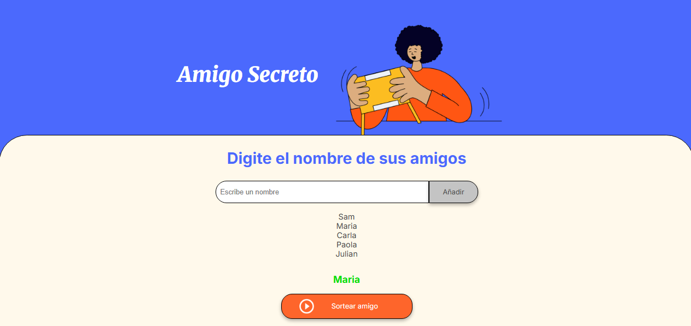

# Challenge-Amigo-Secreto

# 🎁 Challenge Amigo Secreto

Aplicación web sencilla para organizar y sortear un  **amigo secreto** .

Un reto práctico para poner en acción conceptos básicos de  **HTML, CSS y JavaScript** .

## 🚀 Demo

👉 [Abrir aplicación](https://samanthasaavedra.github.io/Challenge-Amigo-Secreto/)

## ✨ Funcionalidades

* Agregar nombres a una lista.
* Validación de entradas vacías.
* Visualizar los participantes en pantalla.
* Sortear un amigo secreto al azar.
* Interfaz intuitiva y responsive.

## 🧩 Tecnologías

* **HTML5**
* **CSS3**
* **JavaScript (Vanilla)**

## 📁 Estructura del proyecto

<pre class="overflow-visible!" data-start="849" data-end="978">

<code class="whitespace-pre!">Challenge-Amigo-Secreto/
├─ index.html
├─ style.css
├─ app.js
└─ assets/
   └─ images/     # capturas y recursos gráficos
</code>

</pre>

## 🖼️ Capturas de pantalla

## ▶️ Cómo usar

1. Clona el repositorio:
   <pre class="overflow-visible!" data-start="1176" data-end="1267">

<code class="whitespace-pre! language-bash">git clone https://github.com/SamanthaSaavedra/Challenge-Amigo-Secreto.git
   </code>

</pre>
2. Abre `index.html` en tu navegador.

## 📝 Mejoras futuras

* Evitar nombres duplicados.
* Reinicio completo de la lista.
* Versión en inglés.
